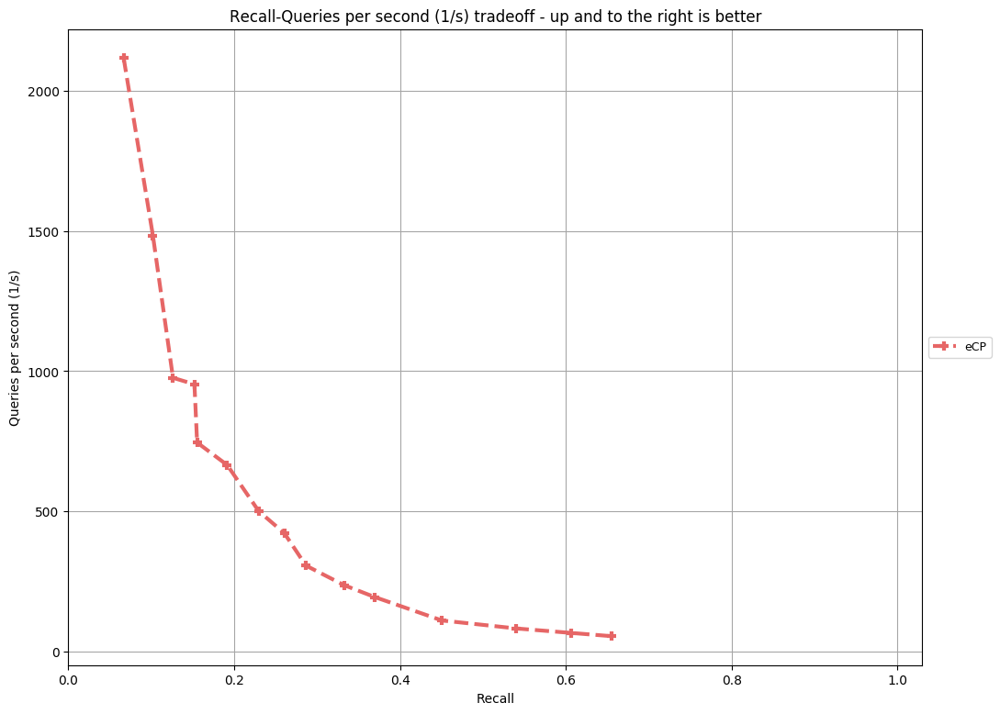
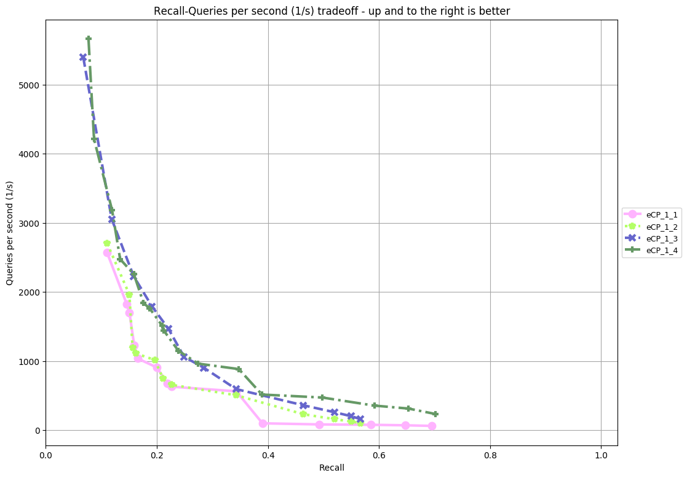

Extended Cluster-Pruning
---

The extended cluster-pruning algorithm is implemented in C++ and provides a python wrapper for usage within the [ANN-benchmarking tool](https://github.com/erikbern/ann-benchmarks/) to compare with other state of the art ANN algorithms. This was proposed as a bachelors project at the IT-University of Copenhagen in spring 2020.

Results
---
mnist-784-euclidean - 4gb RAM


random-xs-20-euclidean - 4gb RAM


[website](results/nime) available with parameter settings

sift-128-euclidean - 8gb RAM


glove-25-angular - 8gb RAM



| Dataset                                                           | Dimensions | Train size | Test size | Neighbors | Distance  |                                                                    |
| ----------------------------------------------------------------- | ---------: | ---------: | --------: | --------: | --------- | -------------------------------------------------------------------------- |
| random-xs-20-euclidean                       |        20 |     9000 |    1000 |       10 | Euclidean |          |
| random-s-100-euclidean                       |        100 |     9000 |    1000 |       10 | Euclidean |          |
| [MNIST](http://yann.lecun.com/exdb/mnist/)                        |        784 |     60,000 |    10,000 |       100 | Euclidean |
| [SIFT](https://corpus-texmex.irisa.fr/)                           |        128 |  1,000,000 |    10,000 |       100 | Euclidean |

### Creating the wrapper
---
1. install SWIG (sudo apt-get install -y swig)

2. run ./generate_wrapper.txt from the command line (run 'dos2unix ./generate_wrapper.txt' if it won't run)

### Wrapper interface
---

The wrapper exposes two functions:
#### eCP_Index
Builds an index with the provided dataset.
Accepts three arguments:
* A dataset (nested list of data points)
* Integer determining how many levels the index should have
* Metric for comparing distance (1 - Angular distance, 0 - Euclidean distance)

#### query
Queries the given index.
Accepts four arguments:
* Index to be queried
* Query point
* Amount of nearest neighbors to return
* Amount of clusters to search

### Python code example

```python
import eCP_wrapper as e
index = e.eCP_Index([[41, 67, 34, 0, 69, 24],[78, 58, 62, 64, 5, 45],[81, 27, 61, 91, 95, 42],[27, 36, 91, 4, 2, 53],[92, 82, 21, 16, 18, 95],[47, 26, 71, 38, 69, 12],[67, 99, 35, 94, 3, 11],[22, 33, 73, 64, 41, 11], [53, 68, 47, 44, 62, 57], [37, 59, 23, 41, 29, 78], [16, 35, 90, 42, 88, 6], [40, 42, 64, 48, 46, 5], [90, 29, 70, 50, 6, 1], [93, 48, 29, 23, 84, 54], [56, 40, 66, 76, 31, 8]], 2, 1)
result = e.query(index, [5,5,5], 5, 1)
```
