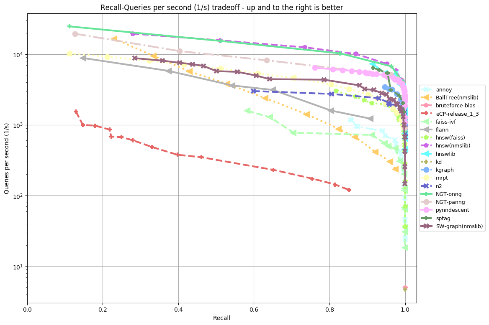
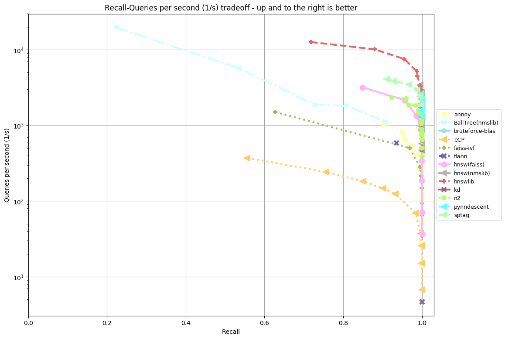
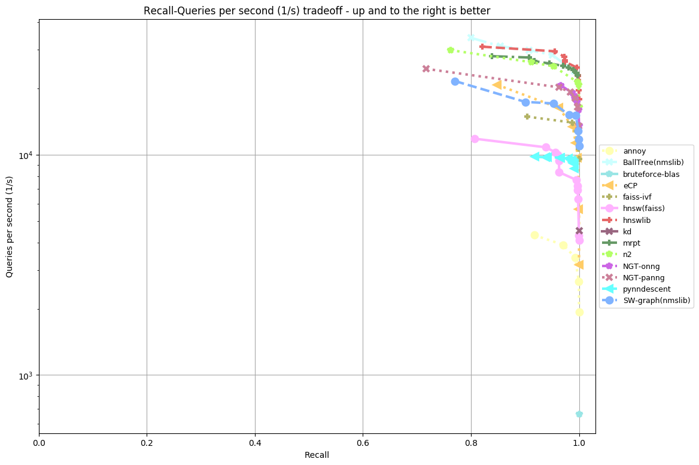
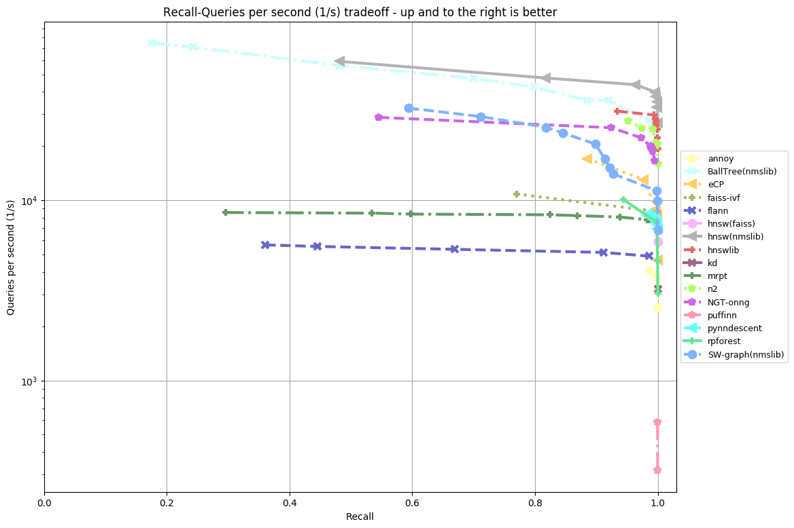
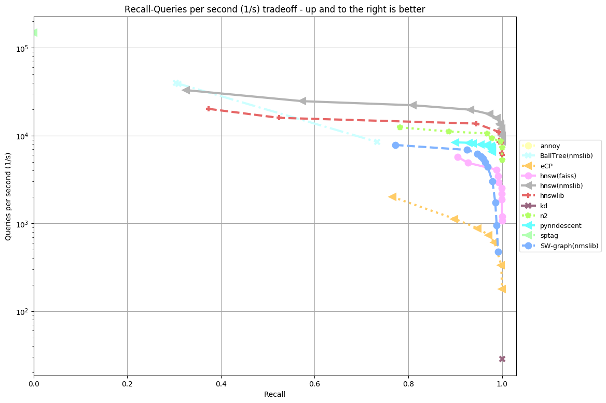
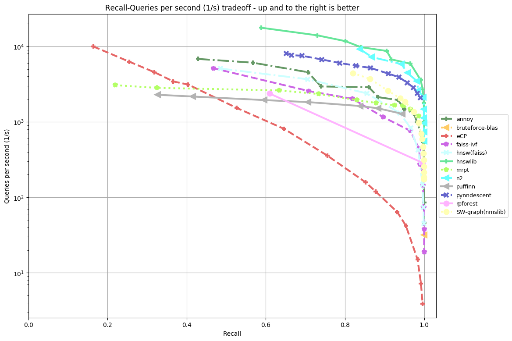

Extended Cluster-Pruning
---

The extended cluster-pruning algorithm is implemented in C++ and provides a python wrapper for usage within the [ANN-benchmarking tool](https://github.com/erikbern/ann-benchmarks/) to compare with other state of the art ANN algorithms. This was proposed as a bachelors project at the IT-University of Copenhagen in spring 2020.

ANN-Benchmarks embedding
---

The installation was tested on a virtualbox running Ubuntu 18.04

Automatic installation
----

To automatically install the eCP algorithm and integrate it with ANN-Benchmarks simply run either ```sudo ./setup_minmal.txt``` or ```sudo ./setup_complete.txt``` from within this repository. This will clone the ANN-Benchmarks repository, merge the required files and run a small experiment

1. Minimal installation

Installs only the eCP docker image for a quick verification that the algorithm has been successfully installed

2. Complete installation

Installs all the algorithm docker containers supported by ANN-Benchmarks (may take a while)

Manual installation
----
Prerequisites:
* Python3
* Pip3
* Docker

Installation:
1. Clone down this repository and [ANN-Benchmarks](https://github.com/erikbern/ann-benchmarks/) 
2. Follow installation instructions for [ANN-Benchmarks](https://github.com/erikbern/ann-benchmarks/#install)
2. Merge the contents of eCP/ANN-Benchmarks with the cloned ANN-Benchmarks repository
3. From ANN-Benchmarks run the command: ```python3 install.py```  (installs all algorithms containers - may take a while)
4. Test that everything is working: ```python3 run.py --dataset random-xs-20-euclidean --algorithm eCP```

This will create results in the ANN-Benchmarks/result directory that can be plotted using: 

```python3 plot.py --dataset random-xs-20-euclidean```

or 

```python3 create_website.py --plottype recall/time --latex --scatter --outputdir website/```

If an earlier version of eCP has been installed, remember to remove the docker container before running install.py again

```docker rmi ann-benchmarks-ecp```


### Creating the wrapper
---
1. install SWIG (```sudo apt-get install -y swig```)

2. run ./generate_wrapper.txt from the command line (run 'dos2unix ./generate_wrapper.txt' if it won't run)

3. If errors occured you may need to install python headers - ```sudo apt-get install -y python3-dev```

### Wrapper interface
---

The wrapper exposes two functions:
#### eCP_Index
Builds an index with the provided dataset.
Accepts three arguments:
* A dataset (nested list of data points)
* Integer determining how many levels the index should have
* Metric for comparing distance (1 - Angular distance, 0 - Euclidean distance)

#### query
Queries the given index.
Accepts four arguments:
* Index to be queried
* Query point
* Amount of nearest neighbors to return
* Amount of clusters to search

### Python code example

```python
import eCP_wrapper as e
index = e.eCP_Index([[41, 67, 34, 0, 69, 24],[78, 58, 62, 64, 5, 45],[81, 27, 61, 91, 95, 42],[27, 36, 91, 4, 2, 53],[92, 82, 21, 16, 18, 95],[47, 26, 71, 38, 69, 12],[67, 99, 35, 94, 3, 11],[22, 33, 73, 64, 41, 11], [53, 68, 47, 44, 62, 57], [37, 59, 23, 41, 29, 78], [16, 35, 90, 42, 88, 6], [40, 42, 64, 48, 46, 5], [90, 29, 70, 50, 6, 1], [93, 48, 29, 23, 84, 54], [56, 40, 66, 76, 31, 8]], 2, 1)
result = e.query(index, [5,5,5], 5, 1)
```

Results
---
| Dataset                                                           | Dimensions | Train size | Test size | Neighbors | Distance  |                                                                  
| ----------------------------------------------------------------- | ---------: | ---------: | --------: | --------: | --------- | 
| random-xs-20-euclidean                       			    |        20  |     9000   |    1000   |       10  | Euclidean |
| random-xs-20-angular                       			    |        20  |     9000   |    1000   |       10  | Angular   |
| random-s-100-euclidean                      			    |        100 |     9000   |    1000   |       10  | Euclidean |
| [MNIST](http://yann.lecun.com/exdb/mnist/)                        |        784 |     60,000 |    10,000 |       100 | Euclidean |
| [Fashion-MNIST](https://github.com/zalandoresearch/fashion-mnist) |        784 |     60,000 |    10,000 |       100 | Euclidean |
| [SIFT](https://corpus-texmex.irisa.fr/)                           |        128 |  1,000,000 |    10,000 |       100 | Euclidean |
| [GloVe](http://nlp.stanford.edu/projects/glove/)                  |         25 |  1,183,514 |    10,000 |       100 | Angular   |


mnist-784-euclidean - 4gb RAM


fashion-mnist-784-euclidean - 4gb RAM


random-xs-20-euclidean - 4gb RAM


random-xs-20-angular - 4gb RAM


random-s-100-euclidean - 4gb RAM


[website](results/nime) available with parameter settings

sift-128-euclidean - 8gb RAM


glove-25-angular - 8gb RAM


[website](results/frem) available with parameter settings

